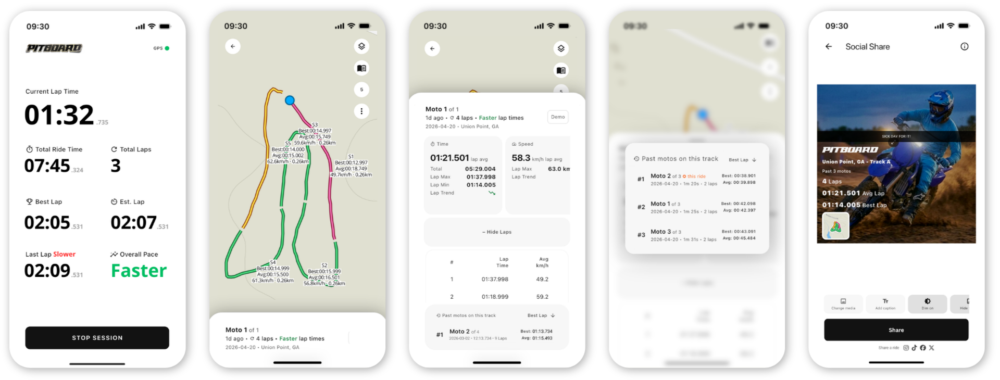
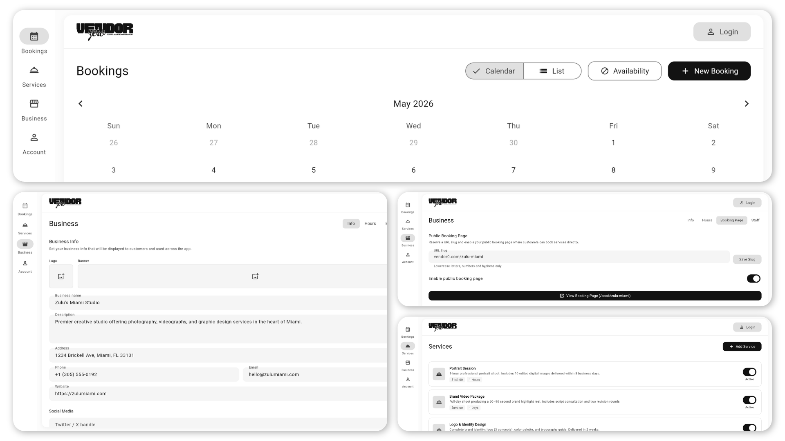

# Kyle Walden — Portfolio

Flutter Developer / Mobile Engineer / Frontend Developer  / Cross-platform Developer. Junior–mid level. All projects solo-built and shipped to production.

**Purpose**: The purpose of this portfolio is to demonstrate [the below key competencies](#competencies) through projects in this monorepo. 

> Quickly review this portfolio by skimming the references under each [competency](#competencies) below, or deep dive into the [project folders](projects) for full context.

## Tech Stack at a Glance

## Projects

### [Pitboard](projects/pitboard) — iOS & Android
This project folder contains a Flutter client app with firebase backend integration.
- Status: Production (shipped) – iOS and Android
- Tech Stack: Flutter · Firebase · Hive · Mapbox

**Description**
A motorsport (motocross) performance mobile app.
- High-frequency (1-10hz) GPS and on-device sensor capture (accelerometers, gyroscopes) for user performance analysis and visualisation
- Technical challenge: Offline-first sync – session data storage for users in remote locations with poor connectivity, with background cloud-sync for data backup and cross-device access.

### [vleet](projects/vleet) — Web
This project folder contains a full-stack app with AI multimodal and agentic features.
- Status: Production (local hosting) – web app
- Tech Stack: React / Next.js · FastAPI · PydanticAI · PostgreSQL 16 + pgvector

**Description**
Vehicle fleet management AI-featured web-app.
- Built with Next.js 15 (App Router) and FastAPI – a platform for managing and tracking vehicle fleet fuel consumption.
- Features an AI layer including an LLM-powered document ingestor (PDF/CSV fuel card statements → structured transactions), a Text-to-SQL natural language analyst, and a pgvector semantic search layer blending relational and unstructured driver notes; 
- Backed by PostgreSQL 16 + pgvector, Redis, and PydanticAI orchestration with Gemini 1.5 Flash.

### [vendor0](projects/vendor0) — Web
This project folder contains only the Flask API backend of a web app.
- Status: Production (shipped) – web app, Firebase Hosting
- Tech Stack: Flutter Web · Flask (Cloud Run) · Firestore · Firebase Auth

**Description**
A service vendor booking management web-app.
- Platform for SME businesses to manage bookings, offered services, business information, and availability.
- Technical challenges: Display a vendor's public customer service booking form with dynamic data – accessed via a service vendor's unqiue URL slug; business data security and access control – ensuring only authorized users can access and modify their business data.

### [mobmeb](projects/mobmeb) — Web
This project folder contains a Flutter client app.
- Status: Development – web app, busy 
- Tech Stack: Flutter Web · Provider

**Description**
Physical venue membership management and check-in methods.
- Flutter web app for venue membership management and check-in platform with QR, NFC, and manual check-in state management.
- [busy] Technical challenge: busy developing check-in methods of NFC, QR, and facial recognition. 

## Competencies

**1. Architectural Integrity** — decoupled, testable, team-ready code

| Pattern | Where |
|---|---|
| MVVM — offline-first sync feature example | [Pitboard → history feature](projects/pitboard/README.md) |
| Services Repository — slug ownership + auth example | [vendor0 → Flask backend](projects/vendor0/README.md) |

**2. AI-product engineering** – Multimodal contexts, agentic workflows
| Example | Where |
|---|---|
| LLM Multimodal API Fluency | [Upload a PDF/CSV fuel card statement](https://github.com/kyle-walden/portfolio/blob/main/projects/vleet/backend/app/services/ingest_service.py) → extracts and returns structured transactions highlighting any anomalies; Text-to-SQL agent queries |
| RAG & Vector DBs | [pgvector stores unstructured driver notes](https://github.com/kyle-walden/portfolio/blob/main/projects/vleet/backend/app/models/driver_note.py) → blends SQL and semantic search |
| Orchestration | [pydantic_ai as the orchestrating agent](https://github.com/kyle-walden/portfolio/blob/main/projects/vleet/projects/vleet/backend/app/services/analyst_service.py) |

**3. Audited AI-Pilot Workflow** — AI-assisted development for speed, audit for quality

| Example | Where |
|---|---|
| Unit tests — auth viewmodel + offline-sync repo | [test/](projects/pitboard/flutter_app/test/) |
| Testing in CI/CD — iOS build + test pipeline | [ios_ci.yml](projects/pitboard/ci/github-actions/ios_ci.yml) |
| AI Agent Eval suite (Golden Queries) | [Vleet Text-to-SQL feature agent validation](https://github.com/kyle-walden/portfolio/blob/main/projects/vleet/backend/tests/test_analyst_evals.py) |

**4. Product-Led Engineering** — analytics-driven iteration, not assumption-driven

| Example | Where |
|---|---|
| Firebase Analytics integration | [analytics_service.dart](projects/pitboard/flutter_app/lib/core/services/analytics_service.dart) |